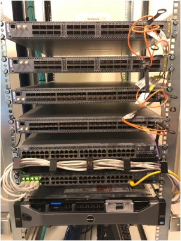

# demolab-juniper

From virtual IP Fabric demo lab to...

... Physical one!

## Environment
- Linux Ubuntu 18.04 Xeon server
- Vagrant 2.0.2
- VboxManage 5.12.18
- Ansible 2.8.1
- Jinja2 2.10.1
- Role juniper.junos 2.1.0
- Junos-eznc 2.2.1

## Notes
- Using server VM needs to enable CPU virtualization
- It's necessary to run Vagrant a first time with provision to build inventory

## Usage
- vagrant up --no-provision
- ansible-playbook site.yml --tags "save_rescue"

*For BGP IP Fabric*
- ansible-playbook site.yml --tags "bgp"

or

- Change Vagrantfile tag to bgp and vagrant up --provision

*To change IP Fabric to OSPF*
- ansible-playbook site.yml --tags "load_rescue,ospf"

or

- ansible-playbook site.yml --tags "load_rescue"
- Change Vagrantfile tag to ospf and vagrant up --provision
