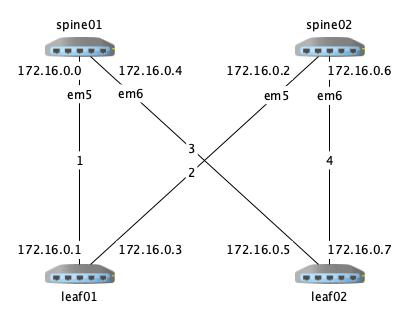

# demolab-juniper

From virtual BGP IP Fabric demo lab to...

... Physical one!

## Environment
- Linux Ubuntu 18.04 Xeon server
- Vagrant 2.0.2
- VboxManage 5.12.18
- Ansible 2.8.1
- Jinja2 2.10.1
- Role juniper.junos 2.1.0
- Junos-eznc 2.2.0

## Usage
Use tag (bgp or ospf) to change the underlay Fabric model
